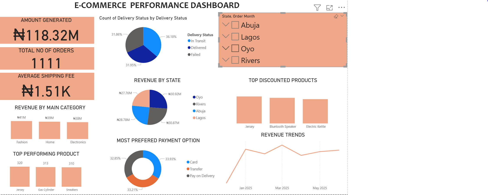

Power BI E-Commerce Dashboard
>End-to-end data analysis from excel power query power bi that uncovers actionable insights from e commerce sales.
##  Overview
This project analyzes e-commerce sales data to identify revenue trends, top-performing products, and regional insights. The data was cleaned and transformed using Excel and Power Query, then visualized with **Power BI*.
## Tools Used
- Microsoft Excel (Data Cleaning & Transformation)
- Power Query (ETL)
- Power BI (Data Modeling, DAX, and Visualization)
##  Key Insights
- Top 5 products contribute over 60% of total revenue.
- Regional sales distribution reveals key high-performing locations.
- Month-on-month growth trends highlight consistent sales increases.
## 🖼 Dashboard Preview
**

##  Learnings
- Improved Power Query transformation and data modeling skills.
- Developed interactive dashboards with slicers, KPIs, and drill-through features.
- Strengthened storytelling with data visualizations.

##  Author
*Chigozie Anulika Enendu*  
Certified Data Analyst (Tech Studio Academy)  
📧 gozieanuli.enendu@gmail.com 
